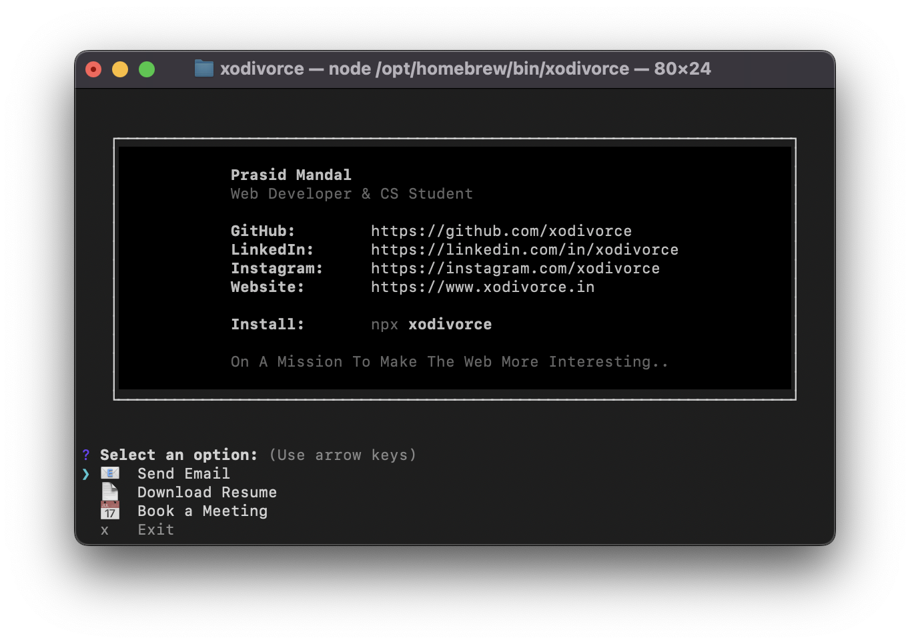

## Npm-xodivorce

### 👀 Preview


> **Run this in your terminal to view the card.**
   ```bash
     npm xodivorce
   ```

#### A sleek, interactive CLI business card - showcasing contact links, resume also more right from your terminal.

[](https://github.com/xodivorce/npm-xodivorce/)
[](https://github.com/xodivorce/npm-xodivorce/)
[](https://github.com/xodivorce/npm-xodivorce/)

> **🥰 Like this project? Please consider giving it a Star (🌟) on GitHub to show us your appreciation. Thank you!**

### ⚡️ Technologies Used


### 🛠️ Installation
   Want to get started quickly? Follow the instructions below to install and run the project on your system.

1. **Clone the repository**
   - Clone the repository to your local machine:
     ```bash
     # Clone using SSH
     git clone git@github.com:xodivorce/npm-xodivorce-preview.git
     # Or using HTTPS
     git clone https://github.com/xodivorce/npm-xodivorce.git
     ```

2. **Set up your environment**
   - Ensure you have [Node.js](https://nodejs.org/) version 14 or higher installed.

3. **Install dependencies**
   - Navigate to the project directory and install the required packages:
     ```bash
     npm install
     ```

4. **Run the tool:**
   - Run the tool from your terminal:

      **Locally:**
      ```bash
      # Link the package for local development
      npm link
      # Run the CLI tool
      xodivorce
      # For quick testing, use the command `node index.mjs`
      ```

      **Production (Public):**
      ```bash
      # Log in to your npm account
      npm login
      # Publish the package to npm
      npm publish --access public
      ```

🐞 **Got Ideas or Spotted a Bug?**  
   Don’t be shy! [*Open an issue*](https://github.com/xodivorce/npm-xodivorce/issues) to discuss new features, enhancements, or any bugs you find. Your feedback is golden!!

### 📄 License
   This project is licensed under the [**MIT License**](LICENSE.txt). You are free to use, modify, and distribute this code for personal or commercial purposes, as long as you include the original copyright and license notice in any copies or substantial portions of the software.

> 🧠 Follow me on [Instagram](https://www.instagram.com/xodivorce) or check out more projects at [xodivorce.in](https://www.xodivorce.in)

<br></br>

****

An open-source project - crafted with ❤️ by **xodivorce**